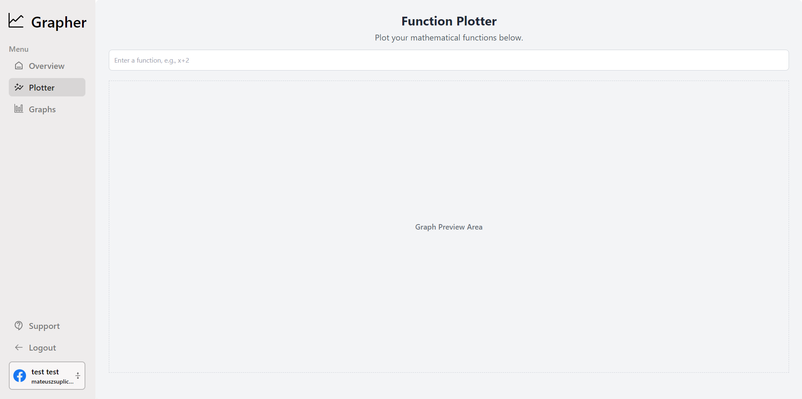

# Grapher

Grapher is a streamlined, powerful application for creating and visualizing data with ease. Built with React, Express, and Node.js and leveraging TypeScript for robust code, Grapher integrates Firebase Firestore and Auth for secure, scalable performance. Deployed on Firebase. Grapher allows you to plot mathematical functions and create graphs using data imported from CSV files or manually entered data points. All graphs are stored in a dedicated storage area for easy access and management. Grapher also provides detailed statistics about your graphing and plotting activities, helping you track and analyze your work. You can log in with your email and password or connect using Google, GitHub, or Facebook for quick access. Grapher combines simplicity with functionality, creating an ideal environment for students, analysts, and enthusiasts to visualize data and explore mathematical functions.

## Features
- Plot mathematical functions with ease
- Create graphs using data from CSV files or manually entered data
- Store all graphs in a personal storage area for easy access
- Access statistics and insights on graphing and plotting activities
- Log in securely with email and password or connect with Google, GitHub, or Facebook

## Live URL
https://grapher-api-unique.firebaseapp.com/

## Screenshots

### Home

### Graph Manager

### Graph Creator

### Graph Viewer

### Function Plotter

### Register

### Login

### Contact

## Technologies

### Frontend
  - React JS (Typescript)
  - Tailwind CSS
  - Firebase auth

### Backend
  - Node JS
  - Express JS

### Database
  - Firestore
  - Firebase Storage
  - 
### Additional Tools
- VS Code
- ES Lint
- Prettier
- Docker

## Contact

In case of any issues or for anmy other inquiries, please contact me at mateuszsuplice@gmail.com

